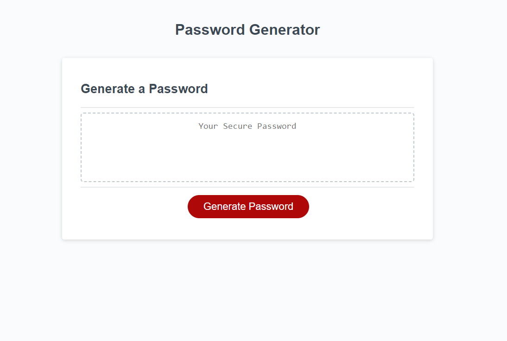

## Description
This assignment was a password generator, where we had to create a working password generator that created passwords between 8 and 128 characters. The password also had to contain one of the following: uppercase letters, lowercase letters, special characters, and numbers. This was the 3rd homework assignment for the coding bootcamp.

## Screenshot

## Site Link
https://mikef13x.github.io/password-generator/ 

## Notes
Worked with Kayla Freeman on this assignment.
